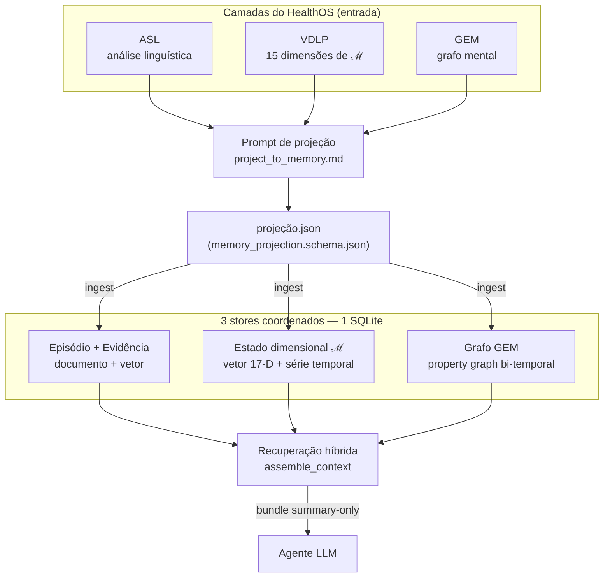
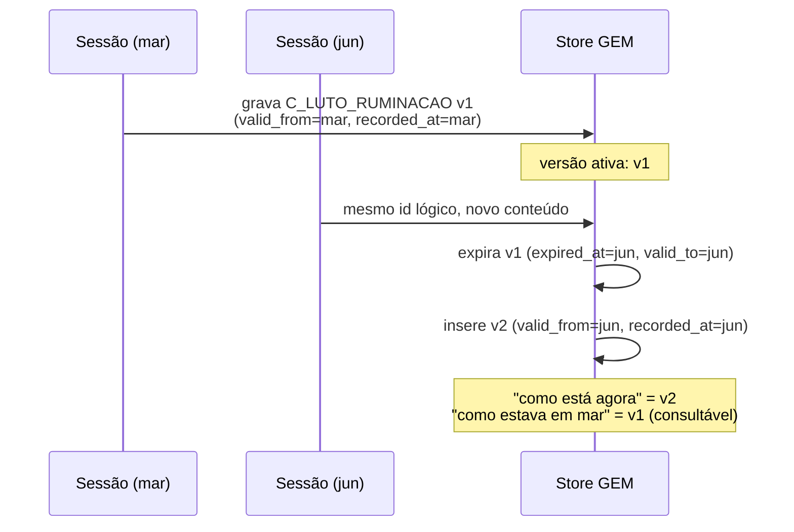
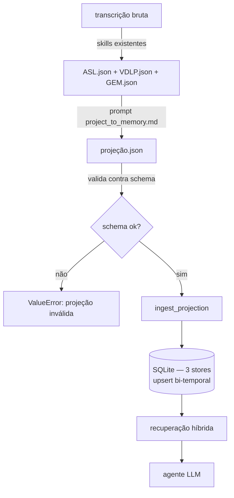
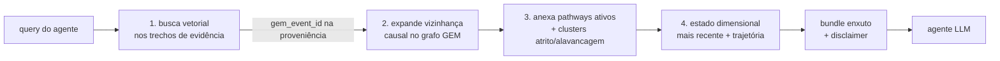
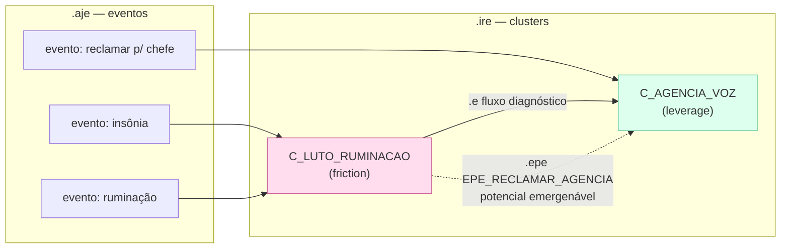
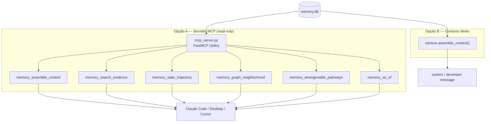
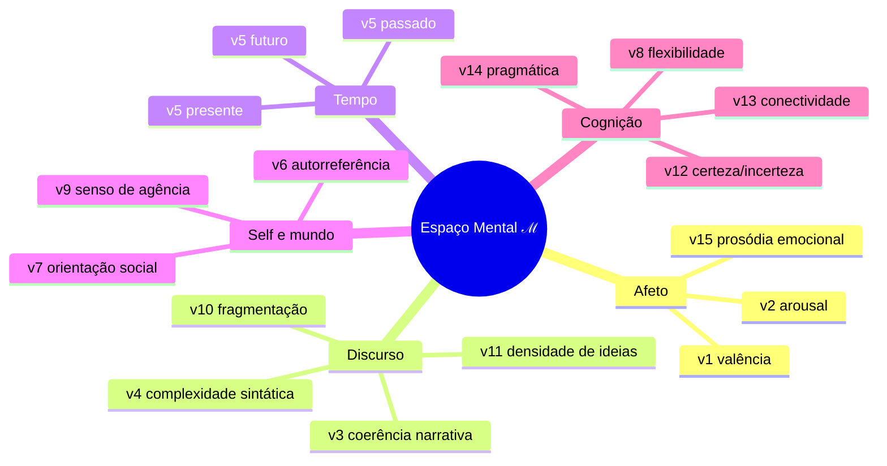
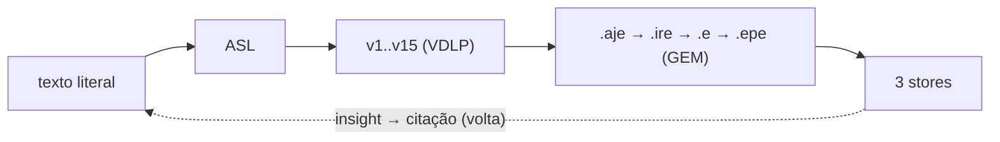

# HealthOS Patient Memory

Memória/RAG **por paciente** para um agente LLM, construída sobre as três camadas
do HealthOS — **ASL**, **VDLP** e **GEM**. Cada camada vai para o store que tem a
forma do seu dado, e tudo é costurado por uma espinha **bi-temporal** com
proveniência, namespaced por paciente.

> **Tese de modelagem:** as três camadas **não** são a mesma coisa armazenada do
> mesmo jeito. ASL é episódio/evidência, VDLP é um vetor-estado interpretável, GEM
> é um grafo causal. A memória mais poderosa respeita essas três formas em vez de
> achatar tudo num único índice vetorial.

---

## Visão geral



---

## Os três stores

| Store | Forma nativa | Vem de | Para que serve |
|---|---|---|---|
| **Episódio + Evidência** | documento + índice vetorial | ASL / `.aje.literal_text` / `evidencias_textuais` do VDLP | substrato factual não-lossy; fonte de **citação** |
| **Estado dimensional ℳ** | vetor 17-D interpretável + série temporal | VDLP (scores v1..v15) | **trajetória** do estado mental; similaridade explicável |
| **Grafo mental GEM** | property graph **bi-temporal** | GEM (`.aje/.ire/.e/.epe`) | estrutura **causal** + **potencial** (emergenabilidade) |

Tudo num único arquivo **SQLite**. O grafo só é usado onde causalidade/temporalidade
importam (GEM) — ASL e VDLP não são forçados num grafo.

```mermaid
flowchart LR
    subgraph SQLite["memory.db (namespaced por patient_id)"]
        direction TB
        E["episodes"]
        EC["evidence_chunks<br/>+ embedding BLOB"]
        DS["dimensional_states<br/>vetor 17-D"]
        GE["gem_events"]
        GED["gem_edges"]
        GC["gem_clusters"]
        GF["gem_flows"]
        GP["gem_pathways"]
    end

    E --> EC
    EC -. provenance.gem_event_id .-> GE
    GE --> GED
    GE --> GC
    GC --> GF
    GC --> GP
```

### Espinha bi-temporal

Cada entidade persistente (clusters, flows, pathways) carrega **dois tempos**:

- **tempo de validade** (`valid_from`/`valid_to`) — verdadeiro no mundo do paciente;
- **tempo de transação** (`recorded_at`/`expired_at`) — quando o sistema soube.

Fatos superados são **invalidados, não deletados**. Assim o agente distingue
"como está agora" de "como estava em março", e o histórico clínico fica auditável.
IDs lógicos estáveis (ex.: `C_LUTO_RUMINACAO`, `EPE_RECLAMAR_AGENCIA`) fazem a
memória **acumular e superar** ao longo do tratamento.



---

## O que instalar

Requer Python ≥ 3.10.

```bash
cd patient-memory
python -m venv .venv && source .venv/bin/activate
pip install -r requirements.txt          # numpy + jsonschema
# opcional, só para o servidor MCP:
pip install "mcp[cli]"
# opcional, instalação editável do pacote:
pip install -e .
```

Sem nenhuma chave de API o pacote já roda: o embedder default é **offline**
(determinístico, lexical). Para busca semântica de verdade, defina
`MEMORY_EMBEDDER=openai` e `OPENAI_API_KEY` (ver `.env.example`).

---

## Onde e como rodar

### 1. Demonstração ponta-a-ponta (offline, sem chave)

```bash
python examples/run_example.py
```

Ingere duas sessões de exemplo e mostra: trajetória dimensional, similaridade de
estados, busca de evidência, travessia no grafo, supersessão bi-temporal,
caminhos emergenáveis e o contexto montado para o LLM.

### 2. Pipeline real, por sessão



**a) Gerar a projeção (LLM):** envie ao modelo o conteúdo de
`prompts/project_to_memory.md` como *system prompt* e, como *user message*, um JSON
com `patient_id`, `session_id`, `session_date` e os três artefatos `asl`, `vdlp`,
`gem`. A saída é a `projeção.json`. Há um helper opcional:

```python
from healthos_memory import project   # requer OPENAI_API_KEY
proj = project.project("PACIENTE_001", "S3", "2026-06-10", asl, vdlp, gem)
```

**b) Ingerir:**

```python
from healthos_memory import db, ingest
conn = db.connect("memory.db")
ingest.ingest_projection(conn, proj)          # valida contra o schema e grava
# ou direto de arquivo:
ingest.ingest_projection_file(conn, "projecao.json")
```

**c) Recuperar:**

```python
from healthos_memory import retrieve
bundle = retrieve.assemble_context(conn, "PACIENTE_001",
                                   "como está o sono e a agência?")
```

---

## Recuperação híbrida (padrão 2026)

`assemble_context` segue o padrão consolidado: **vetor acha a entrada → grafo
expande o contexto relacional → trajetória dá a tendência**.



Concretamente:

1. busca vetorial nos trechos de evidência;
2. a partir do `gem_event_id` na proveniência dos trechos, expande a vizinhança
   causal no grafo GEM;
3. anexa caminhos emergenáveis ativos, clusters de atrito/alavancagem e o estado
   dimensional mais recente.

O vetor dimensional de 17-D (VDLP) é um **embedding interpretável**: similaridade
entre sessões é explicável dimensão a dimensão — diferente de um embedding de texto
opaco.

### O grafo GEM, por dentro

`.aje` (eventos) agregam em `.ire` (clusters), que conectam por `.e` (fluxos
diagnósticos — o que **emergiu**) e `.epe` (caminhos emergenáveis — o que **pode**
emergir, ligando atrito a alavancagem).



---

## Como enviar ao LLM / atrelar a um agente



### A) Servidor MCP (recomendado)

```bash
MEMORY_DB=/caminho/memory.db python -m healthos_memory.mcp_server
```

Config do cliente (ex.: `~/.claude/settings.json` ou `claude_desktop_config.json`):

```json
{
  "mcpServers": {
    "patient-memory": {
      "command": "python",
      "args": ["-m", "healthos_memory.mcp_server"],
      "env": {
        "MEMORY_DB": "/caminho/memory.db",
        "PYTHONPATH": "/caminho/patient-memory/src",
        "MEMORY_EMBEDDER": "offline"
      }
    }
  }
}
```

Ferramentas expostas (todas read-only):

- `memory_assemble_context` — compositor híbrido (evidência + grafo + pathways + estado)
- `memory_search_evidence` — busca semântica nas citações literais
- `memory_state_trajectory` — trajetória dimensional em ℳ
- `memory_graph_neighborhood` — travessia multi-hop no grafo GEM
- `memory_emergenable_pathways` — caminhos atrito → alavancagem (.epe)
- `memory_as_of` — fotografia do grafo válida numa data (raciocínio temporal)

### B) Contexto direto (sem MCP)

Chame `retrieve.assemble_context(...)` e injete o JSON retornado no prompt do seu
agente. O bundle já vem enxuto e com `disclaimer`. A recuperação **não** faz
chamadas de LLM: é busca local + álgebra de vetores (latência baixa).

---

## O Espaço Mental ℳ — vetor de 17 dimensões

VDLP colapsa cada sessão num ponto de ℳ. Para similaridade usamos uma ordenação
**fixa** de 17 componentes (15 dimensões, com v5/orientação temporal expandido em
3 componentes baricêntricos passado/presente/futuro). Essa ordem é um **contrato**:
não reordene sem migrar os vetores gravados.



---

## Escopo desta versão

- **Sem camada de confiança.** Por decisão de escopo, scores de confiança do VDLP
  **não** são modelados nem recuperados aqui. O store dimensional guarda só os
  `score` de v1..v15. (Pode ser adicionado depois sem quebrar o schema.)
- **Artefatos derivados e não-autorizantes.** Tudo que a memória devolve é
  superfície de insight clínico, summary-only — nunca conduta, prescrição efetiva
  ou autorização. O compositor injeta esse `disclaimer` no bundle.
- **Um paciente, um namespace.** `patient_id` isola toda a memória; não há
  vazamento entre pacientes.

---

## Estrutura

```
patient-memory/
├── README.md
├── CLAUDE.md                              # guia para agentes
├── requirements.txt
├── pyproject.toml
├── .env.example
├── schemas/
│   └── memory_projection.schema.json      # contrato da projeção (3 stores)
├── prompts/
│   └── project_to_memory.md               # ASL+VDLP+GEM -> registros de memória
├── src/healthos_memory/
│   ├── __init__.py
│   ├── constants.py    # ordem canônica do vetor dimensional 17-D
│   ├── db.py           # SQLite: schema + helpers bi-temporais
│   ├── embeddings.py   # embedder plugável (offline | openai)
│   ├── vectors.py      # dimensões nomeadas -> vetor 17-D
│   ├── ingest.py       # projeção -> stores (upsert bi-temporal + validação)
│   ├── retrieve.py     # recuperação híbrida + compositor de contexto
│   ├── project.py      # (opcional) chama o LLM com o prompt de projeção
│   └── mcp_server.py   # servidor MCP (stdio) com as ferramentas de memória
└── examples/
    ├── sample_session1.json
    ├── sample_session2.json
    └── run_example.py                      # demo offline ponta-a-ponta
```

## Rastreabilidade

A memória preserva a cadeia do HealthOS de ponta a ponta:



Cada trecho de evidência aponta para seu `gem_event_id`; cada nó/estado guarda sua
origem. Travessia bidirecional: do insight de volta à citação.

---

> **Aviso.** Não é EHR completo, não é produção, não emite prescrição/assinatura
> efetiva nem provê interoperabilidade ou recuperação semântica certificada. É uma
> camada de memória/insight *summary-only* e derivada.
